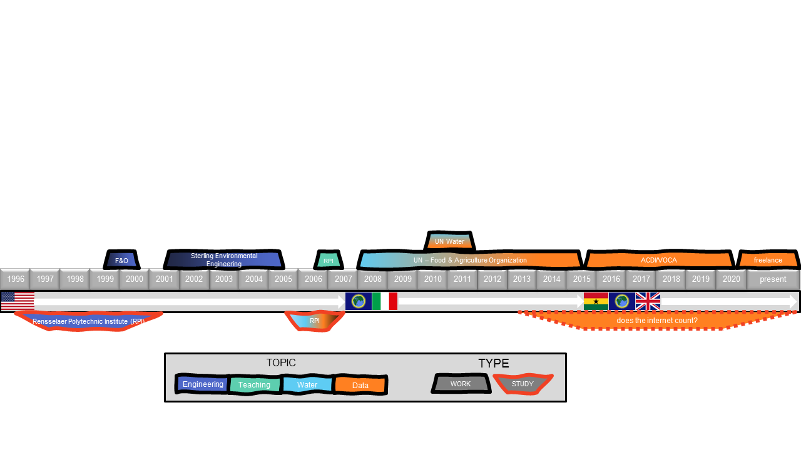

Greetings! 

My name is Amit Kohli. I'm a Mexican/Indian that grew up hopping around South America and then settled in USA where I became an environmental engineer. In 2005 I "wanted more", so after a 6-month world trip, I got my MSc which landed me a job with the UN in Rome. There I became much more interested in systems building and data management. That led me to a Data Director job with a large NGO in Ghana and the UK, and now I'm settled in London where I am a data freelancer in the #data4good space.

I believe in helping and minimizing suffering worldwide. I have spent my entire professional life trying to do this via UN/NGOs and by teaching. If you know of a way I can help more, please do get in touch.

I am addicted to learning and want to do everything and am "writing a book" about that.

## about this blog

One definition of art is "everything done for self-expression". I like that definition. Using that definition, this blog is my artwork. Some posts are analyses, some are providing tools for analysis, and a bunch of other topics. 

[R](https://www.r-project.org/) is my main weapon of choice and the main tool discussed in this blog. I also have released some libraries for R:
 - [ShinyTester](https://cran.r-project.org/web/packages/ShinyTester/index.html) 
 - [TileMaker](https://github.com/DataStrategist/TileMaker)
 - [BulletChartR](https://github.com/ACDIVOCATech/bulletchartr)

## Professionally, who am I?

One way to understand who I am, is by tracking my professional expertise:

But perhaps more interestingly, this representation perhaps shows the _why_ of the changes:

<iframe src = "notData/path.html"></iframe>

## roll-call

Thanks to the following for aggregating and extending my content:

 - https://rweekly.org 
 - https://www.r-bloggers.com

And to [Blogdown](https://bookdown.org/yihui/blogdown) and [Netlify](https://www.netlify.com) For making this blog possible and free! 

## quotes

I guess maybe "who I am" is best answered with quotations that have held meaning for me, starting from my main life motivation below:

> "**I will do strongly, before the sun and the moon, what inly rejoices me and the heart appoints**."
-R. W. Emerson

> "El pasado nunca se va, le gusta esconderse en la musica, en la calle, en los sueños, en los recuerdos, en la vida."
-Mario Benedetti

> Life doesn’t have to reflect your potential or abilities; instead it should reflect your priorities and values.
-T. Kohli

> "Failing is an event, not a person. Yesterday ended last night."
-Zig Ziglar

> "Its OK Amit, I will only die once!"
-A. Rutto

> "Music takes us out of the actual and whispers to us dim secrets that startle our wonder as to who we are, and for what, whence, and whereto."
-F. Nietzche

> "You can't brush your teeth once and for all"
-A. Van Horne

> "Beware of the half truth. You may have gotten hold of the wrong half."
-?

> "Na maré mansa já sei remar
> Na maré brava meu barco
> Não vai virar"
-Esquilo e Bobô.

> "Nothing shows a man's character more than what he laughs at."
-Goethe

> "Nothing shows Amit's character more than the quotes he shows"
-M. Stigler

> "Sometimes life falls into place more accurately than spreadsheets can account for"
-S. Hammons

> "Two possibilities exist: Either we are alone in the Universe or we are not. Both are equally terrifying."
-Arthur C. Clarke

> "Nice people with common sense do not make interesting characters, they only make good former spouses"
-Isabel Allende

> "Some people are so poor, all they have is money"
-?

> "cut, concretize, categorize and condition" (how to let people choose better)
-Sheena Iyengar

> "Forgiveness is the scent the violet leaves on the heel that crushed it."
-Mark Twain

> "Ruin is the destination toward which all men rush, each pursuing his own best interest in a society that believes in the freedom of the commons. Freedom in a commons brings ruin to all."
-Garrett Hardin

> "Si naciste para martillo, del cielo te caen los clavos"
-Ruben Blades

> "If your plan is for one year plant rice. If your plan is for ten years plant trees. If your plan is for one hundred years educate children. "
— Confucius

> "You can't keep a determined man from success. Put stumbling blocks in his way and he takes them for stepping stones"
-Orodi Johannes Odhiambo

> "Malhaya quien dijo miedo, si para morir naci"
-Jorge Negrete

> "It is not necessary to change. Survival is not mandatory."
-W. Edwards Deming

> "Who controls the past, controls the future. Who controls the present, controls the past."
-RATM, based on G. Orwell

> "They used to call me ‘needy’ then they said it was too degrading and I had to be called ‘poor’. Then came ‘impoverished’ followed by ‘underprivileged’. I now have a great vocabulary but I am still hungry."
-?

> "Get rid of anything that isn't useful, beautiful or joyful."
-Regina Brett

> "Be wise enough to not be reckless, but brave enough to take great risks"
-?

> "No Good has ever come from feeling guilty, neither intelligence, policy, nor compassion. The guilty do not pay attention to the object but only to themselves and not even to their own interests, which might make sense, but to their own anxieties."
-Paul Goodman

> "You never count your money when youre sittin at the table.
Therell be time enough for countin when the dealins done."
-Kenny Rogers

> "Every morning in Africa, a gazelle wakes up.
> It knows that it must run faster than the fastest lion or it will be killed.
> Every morning a lion wakes up.
> It knows it must outrun the slowest gazelle or it will starve to death.
> It doesn't matter whether you are a lion or a gazelle.
> When the sun comes up, you better start running."
-African proverb

> "Ya can't shake no hands when your fist be clenched"
-Lil Jacob

> "Everyone has a plan till they get punched in the nose"
-A. Vaillencourt

> "Si de noche lloras por el sol, las lagrimas no te permitiran ver las estrellas"
-?

### Disclaimer:

For any code/instructions/files on this site: if you run any code you don't understand, it is your own fault if your data gets corrupted, computer blows up, and/or climate change eats a baby panda. I'm not responsible for what you choose to do. Furthermore, I think blaming others for your own shortcomings is kind of missing the point to life, isn't it?
