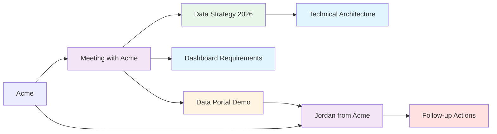

---
title: Why Obsidian Ate My Brain (And I'm Totally Fine With It)
author: amit
date: 2026-02-26
slug: why-obsidian-ate-my-brain
tags:
  - Knowledge Management
  - Tools
  - Obsidian
  - PKM
topics:
  - Knowledge Graphs
  - Note-taking
  - Productivity
draft: false
type: "[[Article]]"
topic: "[[Knowledge Management]]"
---

So I've got this problem. Like most people, I collect data, analysis, insights, meeting notes, random shower thoughts about data strategy, half-baked project ideas, and approximately 47 different versions of "how to explain a knowledge graph to a CEO" - and I need to find them again later, but "they are never where I'm sure I put them". I also have knowledge split up in Chrome bookmarks, in folder notes, in emails, in my physical notebook, etc... you know the drill. I thought I was cursed to live a life of "looking for the thing"... until I found out about Obsidian.

## Introducing Obsidian?

[Obsidian](https://obsidian.md/), is a note-taking app that stores everything as plain text markdown files on your computer, with a little bit of yaml on top. That's it. No cloud lock-in, no proprietary format, no "oops we shut down the servers" BS. Just files on your hard drive, or wherever else you want to put it. MY FILES.

But here's where it gets interesting: Obsidian lets you link notes together using `[[wiki-style links]]`. Write `[[Data Strategy]]` in one note, and boom - it's connected to your Data Strategy note. Do this enough times and you've (kind of) got a *knowledge graph* of how everything in your brain connects (*)



See that? One meeting note connects to a bunch of stuff. Multiply that across hundreds of notes and you've got something magical. By the way... that chart? ALSO TEXT... using [Mermaid](https://mermaid.live/).  

## Why This Actually Works (Unlike Every Other System I've Tried)

### 1. It's Just Files

I've been burned by enough tools that went under (RIP Evernote, kind of). With Obsidian, my notes are markdown files. If Obsidian disappears tomorrow, I still have all my content. I can open them in Notepad. I can grep through them. I can version control them with git. 

This isn't theoretical - my vault IS under git control and I've rolled back my own terrible ideas more than once.

### 2. Links Instead of Folders

Folders force you to pick ONE place for a note. But my note about "ETL processes for social care data" - does that go in Technical? Social Care? Current Projects? Data Strategy? Screw it! The note goes wherever, and I link to it from all those places. Links are bidirectional, so from the ETL note I can see all the places that reference it. It's like Google for your brain, except actually good. At its simplest, structure looks like this:

```markdown
---
type: "[[Technical Note]]"
topic: "[[ETL]]"
---

# ETL at LocalAuthority

We use [[Python]] for [[data extraction]] from [[CareSystem]].
The process connects to [[Data Strategy 2026-27]] goal #3.

See also: [[Data Portal Architecture]], [[Quality Metrics]]
```

Now this note is discoverable from Python, ETL, CareSystem, Data Strategy, Data Portal, and Quality Metrics. Try doing that with a folder. Also, did I mention that this is ALL JUST TEXT AND ITS MAGICAL?

### 3. Custom Metadata

On the note above, see that top section surrounded by "---"? That's called YAML, and every note gets YAML frontmatter:

```yaml
---
type: "[[Meeting]]"
topic: "[[Awesome publication]]"
date: 2026-02-15
---
```

This bit is structured data, so (just like a "real" database), you can query it, and do interesting things with it. For example,  I can use an Obsidian plugin to:

```dataview
TABLE date, topic
FROM "Timestamps/Meetings"
WHERE contains(topic, "Google")
SORT date DESC
```

Boom. Every meeting with Google, chronologically. Just like Notion. But Notion doesn't do the cross-links! The data engineers reading this will be scoffing at the efficiency... but we're talking about a few thousand entries... this works fine!

### 4. The Graph View Is Weirdly Satisfying

Obsidian has a graph view that shows all your notes as nodes and links as connections. It's completely useless for finding anything specific, but watching it grow is strangely motivating as you're getting started. And the local view (where you start from one file), is super useful to find all the connections (or the connections 2 leaps away).

Also, orphaned notes (the ones with no connections) stand out immediately. That's your cue to either link them or delete them.

## How I Actually Use It

### Inbox for Fleeting Thoughts

I chuck everything into `Inbox/` first. All the fast ideas, interesting things to bookmark online, or bits of podcasts I like. Often just a few lines. Then periodically I triage:

- Is this an entity? (Person, Org, Initiative) → Goes to `Stuff/[Type]/`
- Is this chronological? (Meeting, daily log) → Goes to `Timestamps/`
- Is this a fleeting note that should be merged somewhere? → Merge and delete

I can't tell you how nice it is to have everything in one place. It really lowers the cognitive load.

PROTIP: Don't let your inbox overflow. I'm still working on this one :) 

### Meeting Notes That Aren't Useless

I template my meeting notes:

```markdown
---
type: "[[Meeting]]"
topic: "[[whatever_we're_meeting_about_but_its_best_to_keep_some_order_here]]"
date: 2026-02-26
attendees:
  - "[[Person 1]]"
  - "[[Person 2]]"
---

# Meeting with [[Organization]]

## Agenda
- [Topic 1]
- [Topic 2]

## Discussion
[Notes here]

## Actions
- [ ] Follow up on X with [[Person 1]]
- [ ] Send Y to [[Person 2]]

## Links
Related to: [[Project Name]], [[Initiative Name]]
```

After the meeting, I go update the Person and Organization notes with the new info. This way, when I'm prepping for the next meeting six months later, I've got context... and I can look it up. Yes, it's a CRM, except one I made myself that fits me like a glove. (AI has since taken this to a whole other level - stay tuned for that post in this series.)

### Entities Are First-Class Citizens

People, organizations, projects, concepts - they all get their own templates. Small notes are fine. One organization note might just say:

```markdown
---
type: "[[Organization]]"
topic: "[[Manufacturers]]"
---

# Acme

Builds assorted [[devices]] for canines.

```

That's it. But now when I mention Acme anywhere else, it links back here, and I can see everywhere Acme appears in my vault.

### Keep the content in one place, link to it from everywhere.

If I have a document called "Acme" , with a section called "Profits", I can link to the content in that section dynamically by writing [[Acme#Profits]]. But more importantly, I can dynamically port the content to anywhere by putting a `!` in front. What that means is that you can have structured sections on all your asset types, and if you want to create a presentation where you're just listing one section, that presentation is just references. You don't have to rewrite the content. Just gold. 


## What I Love About It

**It grows organically.** I don't need to design the perfect folder structure upfront. I just start writing and linking, and structure emerges from connections.

**It handles ambiguity.** Real-world stuff doesn't fit neatly into categories. Links embrace that.

**It's future-proof.** Plain text files. Can't get more portable than that.

**It scales.** I've got 2000+ notes now and it's fine. Search is fast, and it appears able to take a good amount of notes more.

**Extensions take it to the moon!** You can get extensions made by the passionate community that let this do anything, Eisenhower matrix, Kanban board, journaling, awesome 2-dimensional presentations, websites, etc. You name it, they prolly got it!

## What Sucks About It

**Mobile is clunky.** It works, but typing long-form notes on mobile isn't fun.

**You will waste a lot of time overengineering the perfect system.** How much metadata is enough? How do you clean up EVERYTHING YOU HAVE EVER WRITTEN. The struggle will be real. PRO TIP: Start small.

**It will make you reconsider what learning is.** This sounds weird, but when you're talking about Personal Knowledge Managers (PKM) like this, it makes you start considering, "what is the value of my collection of notes?" "What is my knowledge?" "Why do I need to store any information in a world with Wikidata and Google?" Following this quest will lead you to a lot of introspection, but there's light on the other side of the tunnel. I dunno... I'm still trying to figure it out. At least I have shed a lot of beliefs that no longer serve me.

## Should You Use Obsidian?

If you:
- Work with interconnected information (research, projects, consulting, strategy)
- Value owning your data
- Like tinkering
- Need to find things you wrote months ago

Then yeah, try it. Start with a simple usecase, and see if it sticks.
