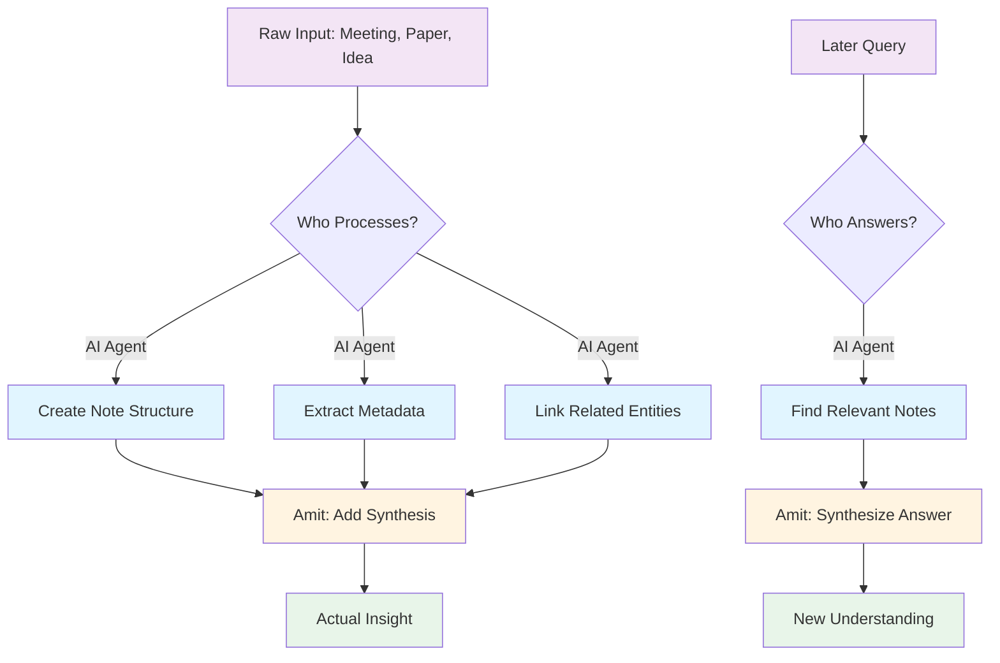

So I did a thing. I hooked up [[GitHub Copilot]] to my Obsidian vault - you know, that [second brain I wrote about](why-obsidian-ate-my-brain.md) - and now I have an AI agent that can read, write, and reorganize my 2000+ notes.

This is either the best productivity hack I've ever implemented or I've just automated myself into irrelevance. Possibly both!

## The Setup: An AI That Reads My Mind (Literally)

Here's what I can do now:

> "Find Jordan from HealthWatch who we showed the data portal to, and update their organization metadata"

And the AI agent:
1. Searches meeting notes for "HealthWatch" + "data portal"
2. Finds Jordan's person note
3. Adds the meeting reference
4. Updates the HealthWatch organization note with Jordan's info
5. Cross-links everything

Properly. With correct YAML frontmatter. Following my ontology. In about 10 seconds.

Compare that to me: grep the vault, squint at results, open six notes, copy-paste metadata, screw up the YAML syntax, fix it, forget to link back, remember an hour later, curse.

## What It Actually Gives Me

### 1. Scaffolding for ADHD

I have neurodivergent tendencies (shocking, I know). Which means:
- Starting a task: Hard
- Continuing a task: Fine  
- Switching tasks: Brain fog
- Remembering I need to update six interlinked notes: LOL no

The AI agent provides scaffolding. It doesn't DO the thinking - it does the busywork that kills my momentum.

Creating an entity note used to be:
1. Open Obsidian
2. Navigate to correct folder
3. Create file with correct naming
4. Add YAML frontmatter
5. Remember what fields this entity type needs
6. Oh right I should link this to three other notes
7. What was I doing again?

Now:
> "Create a person note for Sarah from NHS England who works on data standards"

Done. Correct template, correct location, initial cross-links, ready for me to add actual insight.

The barrier to "just capture this" dropped to zero. That's huge.

### 2. Memory Without the Mental Load

I don't have to remember my own organizational system anymore. I can ask:

> "Show me all initiatives related to data quality that mentioned CareSystem"

And it… just does it. Using my metadata structure, my folder organization, my custom properties.

It's like having a librarian for your brain who actually knows where you put things.

### 3. The Neurodiversity Assist

Look, everyone's brain works differently. Mine happens to:
- Generate ideas constantly (often mid-sentence while talking about something else)
- Forget to write them down
- Get overwhelmed by structure
- Hyperfocus on interesting tangents
- Completely blank on where I documented something

The AI agent catches ideas when they fly by. It handles structure so I don't have to interrupt flow. It finds things I've definitely documented but definitely can't remember where.

It's not a replacement for thinking - it's a really good executive function prosthetic.

## What It Costs Me (THE INEFFICIENCY IS THE POINT)

Here's where it gets weird.

You know the Zettelkasten method? The whole point is **the inefficiency**. Manually writing notes, reformulating ideas in your own words, physically connecting concepts - that's where the learning happens.

Niklas Luhmann didn't just want an archive. He wanted a thinking partner. And the manual labor of maintaining the system *was the thinking*.

So what happens when I automate that away?

### The Uncomfortable Truth

I'm losing some of that deliberate slowness. The AI can:
- Auto-link related notes (so I don't have to think about connections)
- Generate entity notes from meeting transcripts (so I don't have to distill)
- Reorganize metadata en masse (so I don't notice patterns forming)

And that's... potentially bad?

The manual work forced me to:
- **Re-encounter ideas** while linking
- **Reformulate concepts** while summarizing
- **Notice patterns** while reorganizing
- **Question assumptions** while updating

Automation skips that. The vault grows, but does *my understanding* grow?

### Wait, Why Even Have a Local Data Store?

This leads to a deeper question: **What's the point of writing anything down when there's Wikipedia?**

Seriously. Wikipedia has more information, it's better organized, it's maintained by thousands of people. If I just need facts, why not use that?

Because **a personal knowledge base isn't about storing facts. It's about developing thought.**

Your notes have:
- **Your context** (this mattered because of *your project*)
- **Your connections** (you linked this to *your experience*)
- **Your synthesis** (this is *your interpretation*)
- **Your questions** (these are *your curiosities*)

Wikipedia can't give you that. Neither can ChatGPT. Neither can any external knowledge base.

But… can my OWN AI agent give me that if I'm not doing the work?

## The Bargain I've Made

Here's what I've settled on: **The AI handles logistics. I handle synthesis.**

The AI:
- Creates notes from meetings (but I add "what this means")
- Links entities (but I add "why this connection matters")
- Finds related content (but I decide what to do with it)
- Maintains metadata (but I decide what metadata means)

I'm not automating *thought*. I'm automating *bookkeeping*.

### What I'm Not Automating

I still manually:
- Write synthesis sections ("So what does this mean?")
- Question my own assumptions ("Is this actually true?")
- Identify patterns ("Wait, I've seen this problem before...")
- Generate insights ("What if we combined X with Y?")

The AI can surface connections. It can't tell me if they're *meaningful* connections.

## The Pragmatic Win

Yeah yeah, Zettelkasten purists will hate me. But here's the thing:

**I was drowning in my own notes.**

The choice wasn't between "manual perfection" and "automated mediocrity." It was between "automated assistance" and "give up and use folders like a savage."

With 2000+ notes:
- Manual cross-linking every related entity = I'd never finish
- Manual metadata updates across 50 notes = I'd never do it
- Manual search through meeting logs = I'd waste hours

The AI doesn't replace thinking. It makes thinking *at scale* actually possible for my neurodivergent, context-shifting, project-hopping brain.

### The Neurodiversity Angle Again

People with neurotypical executive function might not need this. They can:
- Remember to update six notes after a meeting
- Maintain consistent structure without external enforcement
- Context-switch without losing their place
- Find things they documented without external help

I can't. Or I can, but it takes so much mental energy that I don't have bandwidth left for actual insight.

The AI agent isn't making me lazy - it's making me *functional*.

## Key Findings

1. **AI as scaffolding, not replacement** - It handles bookkeeping so I can focus on synthesis
2. **The inefficiency tradeoff** - Yes, I'm losing some Zettelkasten benefits, but I'm gaining scalability
3. **Neurodiversity assist** - Executive function prosthetics are legit for some brains
4. **Personal knowledge ≠ encyclopedic knowledge** - Your notes capture *your journey*, not just facts
5. **Writing down ≠ thinking** - The question isn't whether to automate note-taking, but whether you're still doing the thinking

## The Honest Answer

What's the point of writing anything down when there's Wikipedia? **To think through it yourself.**

What's the point of a local data store when there's AI? **To develop your unique synthesis.**

What's the point of automation if it eliminates the value-creating work? **It shouldn't. That's the whole trick.**

---

So yeah, I've got an AI reading my brain now. It hasn't made me dumber (I don't think?). It's made my second brain actually usable at the scale I need.

Your mileage may vary. If you're a Zettelkasten purist, I salute you from my automated wasteland. If you're drowning in your own notes and need help, maybe give it a shot.

Just don't automate the thinking part. That's still yours.

---

BLOG_VOICE_APPLIED | TECHNICAL_ACCESSIBLE | VISUAL_ELEMENTS | HONEST_LIMITATIONS | COLLABORATION_INVITE
