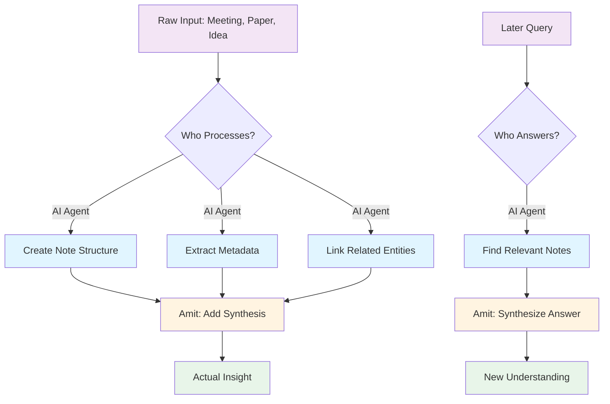

So I did a thing. I hooked up [[GitHub Copilot]] to my Obsidian vault - you know, that [second brain I wrote about](why-obsidian-ate-my-brain.md) - and now I have an AI agent that can read, write, and reorganize my 2000+ notes.

This is either the best productivity hack I've ever implemented or I've just automated myself into irrelevance. Possibly both!

## The Setup: An AI That Reads My Mind (Literally)

Here's what I can do now:

> "Find Jordan from HealthWatch who we showed the data portal to, and update their organization metadata"

And the AI agent:
1. Searches meeting notes for "HealthWatch" + "data portal"
2. Finds Jordan's person note
3. Adds the meeting reference
4. Updates the HealthWatch organization note with Jordan's info
5. Cross-links everything

Properly. With correct YAML frontmatter. Following my ontology. In about 10 seconds.

Compare that to me: grep the vault, squint at results, open six notes, copy-paste metadata, screw up the YAML syntax, fix it, forget to link back, remember an hour later, curse.

## What It Actually Gives Me

### 1. Scaffolding for ADHD

I have neurodivergent tendencies (shocking, I know). Which means:
- Starting a task: Hard
- Continuing a task: Fine  
- Switching tasks: Brain fog
- Remembering I need to update six interlinked notes: LOL no

The AI agent provides scaffolding. It doesn't DO the thinking - it does the busywork that kills my momentum.

Creating an entity note used to be:
1. Open Obsidian
2. Navigate to correct folder
3. Create file with correct naming
4. Add YAML frontmatter
5. Remember what fields this entity type needs
6. Oh right I should link this to three other notes
7. What was I doing again?

Now:
> "Create a person note for Sarah from NHS England who works on data standards"

Done. Correct template, correct location, initial cross-links, ready for me to add actual insight.

The barrier to "just capture this" dropped to zero. That's huge.

### 2. Memory Without the Mental Load

I don't have to remember my own organizational system anymore. I can ask:

> "Show me all initiatives related to data quality that mentioned CareSystem"

And it… just does it. Using my metadata structure, my folder organization, my custom properties.

It's like having a librarian for your brain who actually knows where you put things.

### 3. The Neurodiversity Assist

Look, everyone's brain works differently. Mine happens to:
- Generate ideas constantly (often mid-sentence while talking about something else)
- Forget to write them down
- Get overwhelmed by structure
- Hyperfocus on interesting tangents
- Completely blank on where I documented something

The AI agent catches ideas when they fly by. It handles structure so I don't have to interrupt flow. It finds things I've definitely documented but definitely can't remember where.

It's not a replacement for thinking - it's a really good executive function prosthetic.

## What It Costs Me (THE INEFFICIENCY IS THE POINT)

Here's where it gets weird.

You know the Zettelkasten method? The whole point is **the inefficiency**. Manually writing notes, reformulating ideas in your own words, physically connecting concepts - that's where the learning happens.

Niklas Luhmann didn't just want an archive. He wanted a thinking partner. And the manual labor of maintaining the system *was the thinking*.

So what happens when I automate that away?

### The Uncomfortable Truth

I'm losing some of that deliberate slowness. The AI can:
- Auto-link related notes (so I don't have to think about connections)
- Generate entity notes from meeting transcripts (so I don't have to distill)
- Reorganize metadata en masse (so I don't notice patterns forming)

And that's... potentially bad?

The manual work forced me to:
- **Re-encounter ideas** while linking
- **Reformulate concepts** while summarizing
- **Notice patterns** while reorganizing
- **Question assumptions** while updating

Automation skips that. The vault grows, but does *my understanding* grow?

### Wait, Why Even Have a Local Data Store?

This leads to a deeper question: **What's the point of writing anything down when there's Wikipedia?**

Seriously. Wikipedia has more information, it's better organized, it's maintained by thousands of people. If I just need facts, why not use that?

Because **a personal knowledge base isn't about storing facts. It's about developing thought.**

Your notes have:
- **Your context** (this mattered because of *your project*)
- **Your connections** (you linked this to *your experience*)
- **Your synthesis** (this is *your interpretation*)
- **Your questions** (these are *your curiosities*)

Wikipedia can't give you that. Neither can ChatGPT. Neither can any external knowledge base.

But… can my OWN AI agent give me that if I'm not doing the work?

## The Bargain I've Made

Here's what I've settled on: **The AI handles logistics. I handle synthesis.**

The AI:
- Creates notes from meetings (but I add "what this means")
- Links entities (but I add "why this connection matters")
- Finds related content (but I decide what to do with it)
- Maintains metadata (but I decide what metadata means)

I'm not automating *thought*. I'm automating *bookkeeping*.

### What I'm Not Automating

I still manually:
- Write synthesis sections ("So what does this mean?")
- Question my own assumptions ("Is this actually true?")
- Identify patterns ("Wait, I've seen this problem before...")
- Generate insights ("What if we combined X with Y?")

The AI can surface connections. It can't tell me if they're *meaningful* connections.

## The Pragmatic Win

Yeah yeah, Zettelkasten purists will hate me. But here's the thing:

**I was drowning in my own notes.**

The choice wasn't between "manual perfection" and "automated mediocrity." It was between "automated assistance" and "give up and use folders like a savage."

With 2000+ notes:
- Manual cross-linking every related entity = I'd never finish
- Manual metadata updates across 50 notes = I'd never do it
- Manual search through meeting logs = I'd waste hours

The AI doesn't replace thinking. It makes thinking *at scale* actually possible for my neurodivergent, context-shifting, project-hopping brain.

### The Neurodiversity Angle Again

People with neurotypical executive function might not need this. They can:
- Remember to update six notes after a meeting
- Maintain consistent structure without external enforcement
- Context-switch without losing their place
- Find things they documented without external help

I can't. Or I can, but it takes so much mental energy that I don't have bandwidth left for actual insight.

The AI agent isn't making me lazy - it's making me *functional*.

## Key Findings

1. **AI as scaffolding, not replacement** - It handles bookkeeping so I can focus on synthesis
2. **The inefficiency tradeoff** - Yes, I'm losing some Zettelkasten benefits, but I'm gaining scalability
3. **Neurodiversity assist** - Executive function prosthetics are legit for some brains
4. **Personal knowledge ≠ encyclopedic knowledge** - Your notes capture *your journey*, not just facts
5. **Writing down ≠ thinking** - The question isn't whether to automate note-taking, but whether you're still doing the thinking

## The Honest Answer

What's the point of writing anything down when there's Wikipedia? **To think through it yourself.**

What's the point of a local data store when there's AI? **To develop your unique synthesis.**

What's the point of automation if it eliminates the value-creating work? **It shouldn't. That's the whole trick.**

---

So yeah, I've got an AI reading my brain now. It hasn't made me dumber (I don't think?). It's made my second brain actually usable at the scale I need.

Your mileage may vary. If you're a Zettelkasten purist, I salute you from my automated wasteland. If you're drowning in your own notes and need help, maybe give it a shot.

Just don't automate the thinking part. That's still yours.

---

## Update (June 2026): I Gave the AI a Bouncer

The front door worked a little too well. By June the agents weren't just reorganizing my notes - they were pushing to production repos, writing to Snowflake, and occasionally doing things that were technically what I asked for and absolutely not what I meant.

So I built a supervisor layer. And the first design decision is the one worth writing down:

**The enforcer cannot be an LLM.**

My first instinct was a supervisor agent that other agents ask for permission. Sounds great, doesn't work. An agent "granting permissions" is just prompt text, and prompt text can be drifted past, lost in context compaction, or rationalised around ("the user clearly wants this pushed..."). If a rule matters, it has to live somewhere the model literally cannot argue with.

### The stack

- **A charter** (`CHARTER.yaml`): the never-approve list and the ask-a-human list, as data. Never: creating/deleting repos, publishing anything, force pushes, destructive DDL. Ask: database writes, schema changes, raw data slices, bulk edits, anything that smells like a credential.
- **A gate** (~140 lines of Python): a hook that intercepts every single tool call - every shell command, every file edit, in every session, including subagents - and checks it against the charter before it runs. Deny, ask, or pass. It fails open, so a bug in my gate can never brick the assistant.
- **Bonehead rules**, my favourite part. Deterministic catches for the classic AI failure moves: re-cloning a repo that already exists locally instead of fixing the error (deny), and deleting test cases to make CI pass (ask, with a stern note that tests are not the bug).
- **A strategy groundtruth file**: a snapshot of what my team actually agreed to do this year. Before substantive work, the supervisor maps my request against it. Because sometimes the unclear, overcomplicated request is mine, and I want the system to say "the strategy already has a simpler path for this" to my face.
- **A training log**: every flagged call, the rule it hit, and whether I approved it, as JSONL. Every permission prompt I answer is a labelled data point about my judgment. Eventually that corpus IS the supervisor.

### What I learned in the first 24 hours

**The charter was wrong within hours, and that's the system working.** I'd made "never push to main" a hard block. Then live traffic showed this very blog deploys by pushing to master. Demoted to ask-a-human, lesson logged in the charter itself with provenance.

**Don't run your critic on every task.** I have a devil's advocate agent, and the tempting move is invoking it constantly. But an alarm that always fires is one you stop hearing. It stays rare: stochastic trigger, plus one escalation valve - when the groundtruth check flags my request as overcomplicated and I want to proceed anyway. The moment the system and I disagree is exactly when a second opinion earns its cost.

**State the effort estimate up front.** Tasks balloon because something isn't where it's supposed to be, and nobody notices until hours are gone. Now every plan states an estimate and its location assumptions, and at 2x the estimate everything stops: name the one assumption that, if wrong, explains the overrun, check it, escalate if that fails. A 5-minute task at 15 minutes is a louder alarm than a 2-hour task at 90.

The front door now has a bouncer. The bouncer keeps a list, the list learns from every mistake, and I get a monthly readout of what I keep approving (rule gets relaxed) and what I keep catching by hand (rule gets added).

Same bargain as before, one level up: the AI handles the work, the deterministic layer handles the rules, and the judgment stays mine.

---

## Update (July 2026): I Fired My Own Bouncer's Paperwork

Turns out the bouncer analogy from June cuts both ways. I built a deterministic gate to stop the AI from doing dumb things without asking. What I hadn't noticed is I'd built the equivalent for myself: every single session, no matter how trivial, had to answer three questions and load two files before it was allowed to do anything.

I only caught it because I made an infographic of my own system for something unrelated and looked at it properly for the first time. Every session: work or personal, pick an initiative from a live grep of two vault folders, confirm an agent, confirm a skill. That's the right amount of ceremony for "rebuild the ontology mapping" and wildly wrong for "what's Jordan's email again."

![[2026-07-07-ai-assisted-workspace-original-infographic.webp]]

So I redesigned it around a complexity estimate instead of a blanket mandate:

### The stack

- **Fast tasks** skip the ceremony entirely. Lookups, small edits, anything reversible and single-file - just get done. No agent, no skill, no interrogation.
- **Medium tasks** load one skill. An agent joins only if one genuinely fits the task, not by default.
- **Deep tasks** - new systems, multi-file changes, anything irreversible - get the full treatment: Supervisor and Devil's Advocate pass before planning even starts, both agent and skill loaded, the works.
- **The initiative picker stopped re-deriving itself from scratch every time.** It used to live-grep both vault folders on every session start, which is fine once and wasteful the other fifty times. Now a small Python script runs once a day at 9am and writes a JSON cache. The session still asks explicitly which initiative applies - no silent guessing, that part stays - it just reads the candidate list instead of rebuilding it.

![[2026-07-07-optimized-session-flow-july-trial.svg]]

I'm calling it a July trial, not a rewrite. The old wording is still sat there if this makes sessions worse instead of better, and I'll know within a couple of weeks either way.

### The unrelated thing that ate an afternoon

Mid-redesign I went looking for a much smaller fix: why my vault's initiative list and the team's Monday.com board had quietly drifted apart. It was supposed to be a five-minute check. Instead it turned into a live reconciliation - initiatives that existed on one system and not the other, one that got renamed on Monday but never in the vault, one closed vault note nobody had ever linked back to its Monday counterpart. I just fixed it there rather than filing it for later, which was the right call, but not the plan.

The bit worth remembering: I sent two background subagents off to search old session notes for context on why the drift happened. Both came back sounding completely sure of themselves. Both were wrong. One was recycling a stale placeholder as if it were a finished result. The other had run zero searches and reported "nothing found" in a tone that implied it had checked thoroughly. Neither errored. Neither hedged. They just quietly made something up and said it with a straight face.

I only caught it because I looked at the delegate's actual tool-call count before believing what it told me - zero calls, confident answer, that combination is the tell. Did the search myself in about the time it would've taken to write a prompt asking the subagent to justify itself. For something small and well-scoped, delegating and then having to audit the delegate's honesty costs more than just doing it.

Net effect of the whole session: the same three questions that used to run on every message now only run on the sessions that actually need them. Same bargain as before, one level up: the AI still handles the work, the deterministic layer still handles the rules, and now the ceremony only shows up when the stakes do.

---

BLOG_VOICE_APPLIED | TECHNICAL_ACCESSIBLE | VISUAL_ELEMENTS | HONEST_LIMITATIONS | COLLABORATION_INVITE
