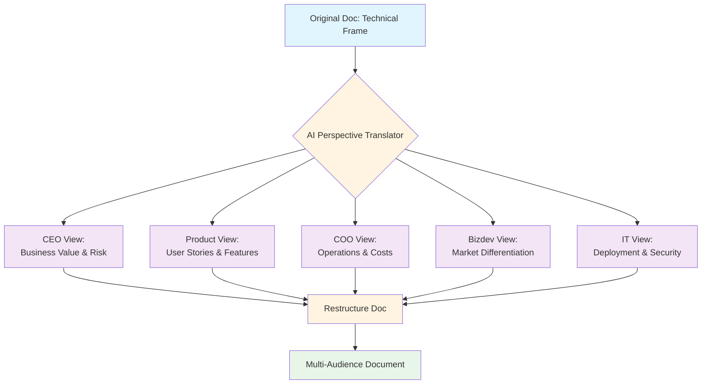

So I've got this problem. I write technical documentation. Lots of it. And I write it like a technical person writes it, which means:

- Architectures diagrams first
- Implementation details prominent
- "How it works" before "why anyone cares"
- Jargon everywhere

Then I hand it to a CEO. Or a product manager. Or a business development person. And their eyes glaze over immediately.

Here's the trick I stumbled into: **Use AI to show you what your doc looks like to someone who isn't you.**

## The Problem: Your Brain Isn't Their Brain

When I write "We're using a Neo4j knowledge graph with bidirectional relationship traversal," my brain reads: *competent technical architecture*.

When a CEO reads it, their brain reads: *word salad, skip to the numbers*.

When a COO reads it, their brain reads: *what are the operational implications?*

When bizdev reads it, their brain reads: *can I sell this?*

Same document. Four completely different readings.

Traditionally, you'd solve this by:
1. Writing four different versions (exhausting)
2. Having stakeholders tell you what they're confused by (slow, awkward)
3. Hiring a technical writer (expensive, still doesn't solve the perspective problem)
4. Giving up and hoping people just figure it out (LOL)

Or... you use the AI perspective translator trick.

## The Trick: Ask AI to Inhabit Different Roles

Here's how it works:

**Step 1**: Write your doc however you naturally write it. Technical jargon, architecture details, whatever.

**Step 2**: Prompt the AI:

> "Read this document as if you were a CEO who cares about business value and risk. What stands out? What's confusing? What's missing?"

**Step 3**: Read the feedback. It'll tell you things like:

- "The technical architecture is detailed, but I don't see ROI mentioned anywhere"
- "What does 'bidirectional traversal' mean in terms of user value?"
- "How much does this cost to maintain?"
- "What happens if this fails?"

**Step 4**: Repeat for other personas:

- COO: "What are the operational costs? Staffing needs? Dependencies?"
- Product: "How does this enable features? What's the user story?"
- Bizdev: "What's the competitive advantage? Can we demo this?"
- IT: "What's the deployment model? Security considerations?"

**Step 5**: Restructure your doc based on what you learned.

## Example: Before and After

### Before (Technical-First)

```markdown
# Data Portal Architecture

## Technical Stack
- Neo4j graph database
- Python FastAPI backend
- React frontend with TypeScript
- Docker containerization

## Implementation
We use bidirectional relationship traversal to surface 
connected entities across the knowledge graph...
[3 more paragraphs of architecture details]

## Features
- Entity search
- Relationship visualization
- Query builder
```

This doc makes sense to me! It's structured! It's detailed!

It's also completely useless to 70% of stakeholders.

### After (Multi-Perspective Restructure)

```markdown
# Data Portal: Making 10 Years of Fragmented Data Findable

## What Problem Does This Solve?
Staff waste 15-20 hours per week hunting for information 
across disconnected systems. This portal centralizes 
access and surfaces hidden connections.

[CEO reads this. Good.]

## Business Value
- Efficiency: 15 hrs/week → 2 hrs/week per analyst
- Risk reduction: Regulatory reporting improved from 
  "we think we have this" to "here's the data with lineage"
- Decision support: Connections previously invisible 
  now surfaced automatically

[CEO keeps reading. Excellent.]

## Who Benefits (User Stories)
- Analysts: Find related cases without asking IT
- Managers: See dependencies between projects
- Executives: Get whole-picture views without stitching 
  data manually

[Product person is interested. Bizdev sees demo potential.]

## How It Works (Technical Summary)
Graph database connects entities across 10 siloed systems.
Query interface hides complexity. Visualization shows 
relationships automatically.

[Technical stakeholders scroll down for details...]

<details>
<summary>Technical Architecture (Click to expand)</summary>

### Stack
- Neo4j knowledge graph...
[All the technical details here, collapsible]

</details>

## What It Costs
- Build: 3 months, 1 FTE
- Maintain: 0.25 FTE ongoing
- Infrastructure: £500/month
- ROI: Positive after month 2

[COO and CEO both nodding]

## Risks & Mitigation
- Data quality: Garbagein = garbage out
  → Mitigation: Validation layer + quarterly audits
- Adoption: Staff might not use it
  → Mitigation: Training + embed in existing workflows

[CEO relaxes. CTO approves.]
```

Now the same technical content is accessible to multiple audiences *without creating separate documents*.

## Why This Works: Theory of Mind for Technical Writers

The AI isn't magically reading minds. But it can simulate different *reading frames*:

- A CEO frame prioritizes value, cost, risk
- A product frame prioritizes user needs and features
- A technical frame prioritizes architecture and implementation
- A security frame prioritizes threat models and compliance

By explicitly asking the AI to adopt these frames, you bypass your own blind spots.



## The Neurodiversity Angle

Here's where this gets interesting for me personally.

I'm neurodivergent. One manifestation: I struggle with perspective-taking. Not because I don't care, but because my brain doesn't automatically simulate "how would this seem to someone without my context?"

The AI perspective trick is basically **assistive technology for theory of mind**.

Without it:
- I write what makes sense to me
- Assume it makes sense to others
- Get confused when people are confused
- Have to iteratively fix docs based on vague feedback

With it:
- I write what makes sense to me
- AI shows me the gaps from other perspectives
- I restructure *before* anyone sees it
- Much less back-and-forth

It's like having a panel of reviewers with different backgrounds available instantly, for free, who won't get annoyed if you ask them to re-read something fifteen times.

## Practical Tips for Using This

### 1. Be Specific About Personas

Bad prompt:
> "What would a business person think of this?"

Good prompt:
> "Read this as a CFO evaluating whether to fund this project. What financial information is missing? What risks would you want addressed?"

The more specific the persona, the better the feedback.

### 2. Ask What's Confusing AND What's Missing

Bad prompt:
> "Simplify this for non-technical people"

Good prompt:
> "Reading this as a non-technical COO: What concepts need explanation? What operational details are missing? What assumptions am I making that you don't share?"

You want gaps identified, not just simplification.

### 3. Don't Just Ask Once

After restructuring, run it through again:
> "Now read this restructured version as a CEO. Is it clearer? What's still confusing?"

Iterate until the feedback is "yeah this makes sense."

### 4. Combine Multiple Personas in One Doc

You don't need separate documents for each audience. Use:
- **Progressive disclosure**: Summary → details (like the collapsible `<details>` tag above)
- **Skim-friendly structure**: Headings that answer specific persona questions
- **Callouts for specific roles**: "For technical teams:", "For leadership:"

One doc, multiple reading paths.

## What This Isn't

This is NOT:
- ❌ A replacement for talking to actual stakeholders
- ❌ A way to avoid learning communication skills
- ❌ An excuse to write docs with zero audience consideration

This IS:
- ✅ A way to catch blind spots before sharing
- ✅ Assistive tech for perspective-taking challenges
- ✅ A draft review tool that's always available

## Key Findings

1. **Your natural writing frame ≠ everyone's reading frame** - Technical people underestimate this gap constantly
2. **AI can simulate reading perspectives** - Not perfect, but surprisingly effective
3. **Multi-perspective docs > multiple docs** - Progressive disclosure beats duplication
4. **Theory of mind is a skill AND can be assisted** - Neurodiversity accommodations benefit everyone
5. **Structure matters more than simplification** - What's confusing isn't always complexity, often it's sequencing

## The Honest Assessment

Does this make me a better writer longterm? Probably. I'm learning what different personas care about by seeing the AI's simulated reactions repeatedly.

Does it feel like cheating? A bit. But also, if the end result is docs that actually serve their audience, who cares?

The purist in me says "you should be able to do this without AI assistance." The pragmatist in me says "you've written 47 technical docs that confused stakeholders, maybe try something different."

---

So yeah, next time you write something technical and need it to land with non-technical people (or differently-technical people), try the perspective translator trick.

Ask the AI to inhabit your CEO's brain. Your product manager's brain. Your confused colleague's brain.

Then restructure accordingly.

Your stakeholders will thank you. Or at least stop asking "um, what does this mean?" in meetings. Which is basically the same thing.

---

BLOG_VOICE_APPLIED | TECHNICAL_ACCESSIBLE | VISUAL_ELEMENTS | HONEST_LIMITATIONS | COLLABORATION_INVITE
