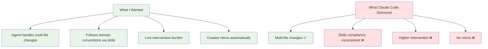

So Anthropic released [ Claude Code](https://claude.ai/code), their CLI-based agentic coding assistant. And since I'm the kind of person who hooversup new AI tools like they're going out of style, I gave it a proper 3-day trial.

Verdict: I'm back on GitHub Copilot + VS Code.

This isn't a hit piece - Claude Code has some genuinely interesting ideas. But for my workflow, the friction was higher than the benefit. Here's what I learned.

## What Claude Code Promises

Unlike GitHub Copilot (which lives inside your editor suggesting completions), Claude Code is:
- **Agentic** - You describe a task, it plans and executes multi-step changes
- **CLI-based** - Terminal interface, not IDE integration
- **Conversational** - Chat-driven workflow, maintains project memory between sessions

The pitch: "Tell it what to build, it figures out how."

Sounds great! And for some use cases, it genuinely is. But the devil's in the details.

## What Actually Happened

### The Good: When It Worked, It Worked

Claude Code shines for:
- **Exploratory refactoring** - "Restructure this to use dependency injection" and it... does it
- **Cross-file changes** - Updates imports, renames functions across modules, stays consistent
- **Explaining legacy code** - Point it at a gnarly function, ask what it does, get a clear answer

These are legit wins. Having an agent that can read, reason about, and modify multiple files coherently is powerful.

### The Friction: Death by a Thousand Paper Cuts

But daily use revealed problems:

**1. Higher Manual Intervention**

With Copilot in VS Code:
- Hit tab, accept suggestion, keep coding
- Inline, fast, low mental overhead

With Claude Code:
- Describe task in terminal
- Wait for plan
- Review proposed changes
- Approve each file (or batch approve)
- Check if it actually worked
- Often: fix what it broke

I felt more like a *manager* than a *developer*. Sometimes that's what you want! But most of the time, I just wanted to write some damn code.

**2. Context Degraded Faster**

This was subjective but consistent: mid-session, Claude Code would "forget" details I'd mentioned earlier. Copilot in VS Code felt like it maintained context better across the whole session.

Maybe this is a model difference (Sonnet vs GPT-4 Turbo). Maybe it's how context is loaded. But practically, I found myself re-explaining things more with Claude Code.

**3. Ghost Sessions Everywhere**

Claude Code creates a session for every command. Including stray `/exit` commands.

So you end up with:
```
~/projects/.claude/sessions/
  2026-02-24-actual-work/
  2026-02-24-see-ya/
  2026-02-24-another-exit/
  2026-02-24-why-is-this-a-session/
```

...you get the idea. Invisible clutter with no signal.

**4. No Retrospectives Created**

I have a system: after big sessions, I create retrospective logs in `Files/session_logs/`. These capture what happened, what went wrong, lessons learned.

GitHub Copilot (via the instructions I' ve set up) creates these. Claude Code? Nope.

Instead, it maintained `MEMORY.md` files inside `~/.claude/projects/` tracking *project state*. Which is useful! But it's not the same as a retro capturing *what happened this session*.

Result: Multiple work sessions (data quality queries, amitkohli.com rebuild) are effectively undocumented. Future me will not thank past me for this.

## The Critical Failure: Skills Ignored

This one's the dealbreaker.

I've got a system where certain skills MUST be invoked for specific tasks. My `copilot-instructions.md` has a giant **MANDATORY SKILL USAGE** section in all-caps that says:

> Before writing any R code, you MUST read `.github/skills/r-data-scientist/SKILL.md`

This isn't optional. The skill file contains domain-specific conventions, gotchas, and patterns.

**Task**: Align one data source with another (R script).

**What Claude Code did**: Used a generic "Explore" agent. Ignored the skill requirement entirely.

**What went wrong**:
1. Silently broke a data gather (table came back empty)
2. Didn't check if it worked
3. Wrote ~30 lines of defensive `intersect(names(df), c("col1", "col2", ...))` code to paper over the missing columns
4. This defensive code would *never actually trigger* - the query would just return blank data silently in production

I had to manually intervene to make the script functional. Which is the opposite of what agentic workflows are supposed to achieve.

### Was This a Model Problem or a Tool Problem?

**Both**, actually.

**Model quality issue (Opus 4.6)**: Writing defensive code that doesn't defend is a judgment failure. That's on the model.

**Instruction-following issue (Claude Code)**: Ignoring the MANDATORY SKILL USAGE instruction is on the tool. This isn't a capability ceiling - it's an instruction-following failure.

Copilot in VS Code follows these instructions consistently. Claude Code... sometimes does?

## What I Wanted vs What I Got



Claude Code got the "agentic" part right. But lost on the details that make daily dev work smooth.

## Where Claude Code Might Shine

Fair's fair - there are use cases where Claude Code's modality makes sense:

**1. Big Refactorings**
When you need to restructure a codebase and want an agent to plan and execute comprehensively.

**2. Exploratory Codebases**
You're dropped into an unfamiliar project and want an agent that can navigate and explain while you learn.

**3. Non-Real-Time Work**
You describe a task, go make coffee, come back to reviewed changes. Async > interactive.

**4. Terminal-First Workflows**
If you live in tmux and rarely touch an IDE, the CLI modality might feel natural.

For me? None of these matched my daily flow. I'm writing code interactively, in familiar codebases, with tight feedback loops. Copilot's inline suggestions fit that better.

## The Verdict: It's Not You, It's Me

Claude Code isn't *bad*. It's just optimized for a different workflow than mine.

**What I need**:
- Low-latency suggestions mid-flow
- Consistent instruction-following (especially skills)
- Inline, in-editor, invisible until helpful
- Retro documentation for learning

**What Claude Code optimizes for**:
- Batch task execution
- Conversation-driven development
- Terminal-native workflows
- Project memory over session memory

Pick your tooling based on your workflow, not hype.

## The Silver Lining: Anthropic's Refund Policy

One thing Anthropic absolutely nailed: **cancellation with zero dark patterns**.

I cancelled, requested a refund, got it. No friction. No "are you sure?" guilt loops. No buried cancel buttons.

In an industry full of subscription traps, that's genuinely refreshing.

## Key Findings

1. **Agentic ≠ better** - Task agents are powerful for some workflows, but add overhead for others
2. **Instruction compliance matters** - If an AI assistant ignores mandatory instructions, it's not actually assisting
3. **Context retention is make-or-break** - Felt worse than Copilot, though this might be subjective
4. **Retro hygiene matters** - Undocumented sessions = lost learning
5. **CLI vs IDE is a real tradeoff** - Not just preference, fundamentally different interaction models

## Would I Try It Again?

Maybe. If:
- Context retention improves
- Skills compliance becomes reliable
- Session hygiene gets cleaned up
- I have a big refactoring project that suits batch task mode

But for daily interactive dev? GitHub Copilot + VS Code won on every metric that matters *to me*.

---

Your mileage may vary. If you're a terminal-first dev who likes delegating tasks to agents instead of writing code interactively, Claude Code might be perfect for you.

For me, the future looked like *less coding*, but felt like *more babysitting*. And I've got enough to babysit already thanks to my Obsidian vault and its 2000+ notes.

---

**Disclaimer**: This was February 2026. Claude Code is actively developed. By the time you read this, some of these issues might be fixed. Or worse. Who knows! Such is life in AI tooling.

---

BLOG_VOICE_APPLIED | TECHNICAL_ACCESSIBLE | VISUAL_ELEMENTS | HONEST_LIMITATIONS | COLLABORATION_INVITE
