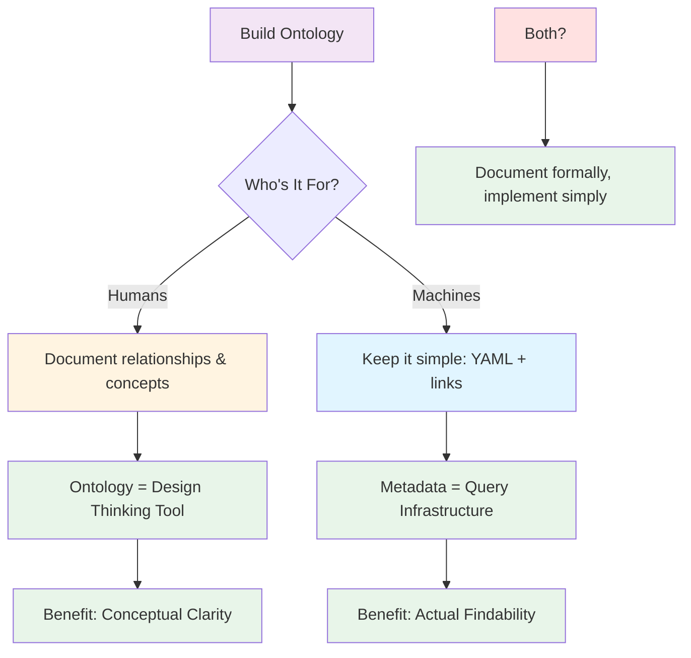

So I had this brilliant idea. Since I've got an AI agent working with my Obsidian vault, why not give it a *formal ontology* to work with? Relationship definitions, semantic triples, property hierarchies - you know, the good stuff from the Semantic Web era.

Spoiler: The AI didn't use it. At all. Not even a little bit.

But the journey was interesting enough that I figured I'd document what I tried, what failed, and what I learned. Because apparently that's what I do now - expensive experiments for your entertainment.

## The Brilliant (Naive) Plan

Here's what I built:

```
_ontologies/
├── core/
│   ├── relationship_registry.md    # All valid relationships
│   └── entity_types.md              # Type hierarchy
└── social care/
    ├── concepts/                    # Domain concepts
    └── properties/                  # Property definitions
```

My relationship registry looked like this:

```markdown
## provides_service

**Domain**: [[Organization]]
**Range**: [[Service Type]]
**Inverse**: service_provided_by
**Description**: Organization delivers this service

**Example**: [[NHS]] [provides_service::[[Healthcare]]]
```

And in my actual notes, I'd write inline semantic triples:

```markdown
# Care Quality Commission

[regulates::[[Social Care Providers]]]
[provides_service::[[Inspection Services]]]
[part_of::[[Department of Health]]]
```

Beautiful, right? Formal relationships, domain constraints, inverse properties - the whole RDF stack just… sitting there in markdown.

## What I Thought Would Happen

Me: "Show me all organizations that regulate care providers"

AI: *Consults relationship registry, identifies `regulates` relationship, traverses graph following semantic triples, returns HealthWatch*

What actually happened:

AI: "Let me semantic_search for 'care quality regulate providers'… found some stuff"

The AI treated my formal ontology like… documentation. Which, fair enough, it IS documentation. Just not *executable* documentation.

## Why The AI Didn't Use It

### Problem 1: No Native Tools for Graph Traversal

The AI has:
- `semantic_search` (keyword/context matching)
- `grep_search` (regex pattern matching)  
- `read_file` (grab text)

It does NOT have:
- "Parse inline field syntax and extract triples"
- "Follow relationship chains"
- "Query by semantic relationship type"
- "Use property definitions to infer connections"

I built a graph database... and gave it grep. 

### Problem 2: LLMs Don't Do Inference

This one's the kicker. Even if the AI could read my relationships, it wouldn't automatically *infer* from them.

Example:
```
[[Consulting Firm]] part_of [[Company Group]]
[[Company Group]] provides_service [[Advisory]]
```

A reasoning engine would infer: *Consulting Firm provides Advisory (via Company Group)*

An LLM? It sees two separate statements. No inference. No transitive properties. No relationship composition.

As one wise person in the Obsidian forums put it: "An LLM alone has trouble doing inference."

### Problem 3: Semantic Search Was Already Good Enough

Turns out, for most queries, fuzzy semantic search works fine:

**My query**: "Organizations working on care provider regulation"

**What returns**:
- Care Quality Commission (has "regulation" in text)
- Ofsted (context: "regulatory body")
- Department of Health (context: mentions regulation)

Perfect? No. But 80% accurate? Yeah.

And I don't need relationship definitions for that.

## What Actually Works: Practical Metadata

You know what the AI DID use effectively? **Simple YAML frontmatter.**

```yaml
---
type: "[[Organization]]"
topic: "[[Social Care]]"
org_type: regulator
status: active
---
```

With this, the AI can:
- Filter by type
- Group by domain
- Sort by status
- Query consistently across 2000+ notes

No fancy ontology needed. Just consistent, boring metadata.

## The Ironic Twist: The Ontology Helped My *Human* Brain

Here's the weird part: building the ontology was still useful. Just not for the AI.

### For Me (Human), It Provided:

**1. Conceptual Clarity**

Forcing myself to define relationships made me think:
- Wait, what's the difference between `works_for` and `employed_by`?
- Should `provides_service` be org-to-service or org-to-org?
- Is `regulates` symmetric? (Spoiler: no)

That clarity fed into better note-taking, even if the AI agent wasn't using the formal definitions.

**2. Consistency Boundaries**

The ontology = documentation of my own rules:
- People notes go in `Stuff/People/`
- Organizations get `org_type` property
- Relationships follow this vocabulary

The AI didn't traverse my semantic graph, but it DID respect my structural conventions - because they were documented.

**3. A Framework for Thinking**

When adding a new entity type, I'd think: "What relationships does this have? What properties? Where does it fit?"

The ontology scaffolded my mental model. The AI just happened to ignore the scaffolding.

## What I'd Do Differently: Pragmatic Semantic Knowledge



If I were starting over:

### Keep: Ontology as Documentation

For humans to understand the domain model. Write down:
- Entity types and their properties
- Relationship vocabulary
- Domain concepts

But don't expect machines to query it directly.

### Ditch: Inline Semantic Triples

This looked cool:
```markdown
[provides_service::[[Healthcare]]]
```

But added complexity without AI-queryable benefit. 

Use instead:
```markdown
Provides service: [[Healthcare]]
```

Same information, readable by humans, easier to grep, less syntax to maintain.

### Add: Dataview Queries Instead of Graph Traversal

Want "all organizations regulating care providers"? Write one Dataview query:

```dataview
TABLE org_type
FROM "Stuff/Organizations"
WHERE org_type = "regulator" AND contains(topic, "Care")
```

Boom. Queryable. No fancy semantic reasoning required.

### Keep: Consistent Wiki-Links

`[[Entity Name]]` everywhere. This lets the AI:
- Trace connections via link graph
- Find related content
- Update bidirectionally

Not semantic web-level formal, but functional.

## Three Paths Forward (If You Want Ontology + AI)

**Option 1: Dataview + Inline Fields (Pragmatic)**

Use Dataview syntax everywhere:
```
org_type:: regulator
provides_service:: [[Healthcare]]
```

Dataview can query it, AI can read it, you're done.

**Option 2: Python + RDF Export (Formal)**

Keep ontology formal. Write a script that:
- Parses Obsidian → RDF triples
- Loads into actual graph database (Neo4j, etc.)
- Provides query API for AI to call

You get real semantic reasoning, but... you've now got infrastructure.

**Option 3: GPT + Prompting (Hack)**

Prompt the AI explicitly:
> "Using the relationship definitions in `_ontologies/relationship_registry.md`, show me all entities where A regulates B"

The AI CAN read your ontology and apply it... if you remind it to. Every time. Forever.

Pick your tradeoff.

## Key Findings

1. **LLMs don't do inference** - Reading relationship definitions ≠ traversing a knowledge graph
2. **Semantic search is surprisingly good** - Fuzzy matching works for 80% of queries
3. **Simple metadata > formal ontology** (for AI agents, at least)
4. **Ontology = Thinking Tool** - Building it clarifies your model even if machines don't query it formally
5. **Annotation effort must pay off** - Don't add structure speculatively; add it when you have a specific query need

## The Honest Assessment

Was building a formal ontology for my Obsidian vault worth it?

**For the AI agent**: No. It didn't use it.

**For me**: Yes. It forced conceptual clarity and better structure.

**Would I do it again?** Probably not. I'd start with simple YAML + wiki-links, see what query needs emerge, and formalize only when friction appears.

The semantic web dream is great. But sometimes grep and a bit of YAML is all you actually need.

---

If you're thinking about formal ontologies for your second brain: start small. Really small. Add one property. See if it helps. If it does, add another. 

Don't do what I did and build the entire semantic web in your bedroom only to discover your AI agent is perfectly happy with `grep "regulator" Stuff/Organizations/*.md`.

Save yourself the pain. Or don't - the pain was kinda fun actually.

---

BLOG_VOICE_APPLIED | TECHNICAL_ACCESSIBLE | VISUAL_ELEMENTS | HONEST_LIMITATIONS | COLLABORATION_INVITE
