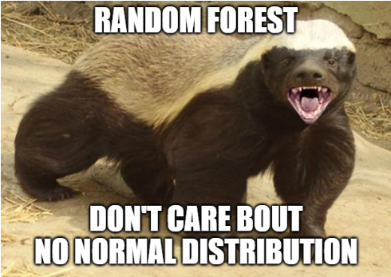

Quick disclaimer, Random Forests, or RF, don't solve all problems. If you want to identify cats in an image, or do text stuff like figure out what political candidate mentioned "pudding" more often, or reinforcement learning, RFs can't help you. But for regression or classification tasks with numerical data, RFs are the best tool around.

What are Random Forest models? Imagine trying to predict whether I’d buy an ice cream or not. Well, whether I do or don’t will depend on stuff like the weather, and my finances. Let’s look at a simple decision tree that shows how these determine whether I buy ice cream or not.

Our ice cream case is easy, but what if we have 100 columns (also called features), and 10,000,000 rows of data? The random forest algorithm works by making a bunch of decision trees, and then averaging the results of all the trees to get a final answer. Many trees make a forest, get it? :) But not all trees are the same, We haven’t discussed the "random" bit yet. There are two "random" things actually! Each tree only looks at a few rows, and only a few columns. So in our dataset above with 100 columns and 10M rows, each tree might select 4 columns and 1000 rows only, and they all grab columns and rows randomly, which is super important! 

You might be thinking: "So averaging a bunch of simple trees that only know a few things, and only look at a portion of the data, somehow arrive at the correct decision? Hrm... sounds fishy!" But it works! Hopefully after reading this blog you’ll know why. Also, I *highly recommend* you check out this [interactive demo](https://mlu-explain.github.io/random-forest/) about RFs. It is really wonderful!

> _Extra credit: Compare and contrast RFs and the democratic process. People get to vote and decide their country's leadership even if most of them are unable to deeply evaluate the feasibility of policies that will actually affect their lives (things like healthcare, the economy, foreign relations, and the environment). People also tend to have more local knowledge, they don't tend to know a lot about other parts of the country. Does this mean that they act like "trees" in our Random Forest, and thus democracy actually has a mathematical basis? If not, why not?_

If you are still thinking to yourself "hey self, how is it possible that adding up a bunch of stupid trees is accurate?", or "why not just train trees with *all* the data instead?" or something along those lines, you clearly didn't click the link above so... go do that now please. I'll wait.

Rather than explain _how_ RFs work, this article will explain why I love them. So with no further ado, here are the top 10 reasons why RF is all you need.

## 1. They are accurate

Random Forests are frequently used on the popular Machine Learning (ML) platform Kaggle, and are seen as a competent "first pass approach". This is, among other reasons, due to the fact that RF is "pretty accurate", even on default settings. We will discuss some of the reasons why in later sections but for now, just know it's well respected and just a good all-rounder. 

My attitude to accuracy or any other metric is that "pretty good" tends to be a really good place to start. Regardless of the model you train, bringing your whole process to production will represent many more challenges than you might have thought. Because of that, you're much better off focusing your energy on deploying the model, and improving its accuracy after.

## 2. They are easy to use

RFs are among the simplest ML models to understand and use. This is important because it means that the model can be employed by people who are not ML experts, and  it is  less likely to be misused. Using a simple model also helps from an institutional memory perspective... it maximises the chances that someone will be able to pick the work up: since the algorithm is so old, basically everybody in ML knows how to use it.

In fact, my advice to beginners in ML is to learn this RF first. This way, you can focus all your energy on understanding **how to solve your problems using ML**, rather than learning about the infinite complexities of ML. By the time someone tells you about the new meta‐heuristic Bayesian network classification model they were reading about, you'll be on your third or fourth deployment. Who wins?

## 3. They are non-parametric

Several simple models like linear or logistic regression used in ML require that the data be shaped in a specific way, for example, the thing you're trying to predict "should be normally distributed". In the real world, data frequently displays other distributions and requires a transformation method like Box-Cox to coerce it into the correct form. Which is fair play, I guess, but if the "data isn't normally distributed" and we have another model that "doesn't expect normal distribution", and that other model is awesome in a ton of other ways, why complicate things?

## 4. They are resistant to overfitting

Other tree- based methods like Gradient Boosting Trees tend to outperform RF, but this performance gain tends to demonstrate higher degrees of overfitting. This means that the performance gain you have right now might not be significant in production. This kind of goes back to the whole "don't go crazy optimising accuracy" thing. You are much better off spending more time in the feature engineering space, or getting more/better data, at least for the first pass.

## 5. They are relatively fast to train

RFs are faster to train than Gradient Boosted Trees,  or other comparable methods, even on huge datasets. Speed is important because it means that you can iterate faster and try different things. This matters because the success of a ML project often depends on the number of iterations that you can run, in that "it takes a few tries to get it right". Being able to iterate quickly lowers costs either directly or indirectly.

Also, RF can be easily parallelized, which means that you can train them on multiple CPUs or GPUs simultaneously because each tree is completely separate from every other one. This is important not only because it can speed up training, but because it can make training on very large datasets possible.

## 6. They require little data preprocessing

RFs can handle data that is not normalised, and can deal with missing values and categorical variables without the need for dummy variables. This is important because it means that you can use RFs with less effort in data preparation, and that you can use them with data that is not in the "correct" format.

## 7. They are easily interpretable

Random Forest models are much easier to interpret than many other ML models, such as neural networks. This is important because you can understand _why_ the model is making the predictions that it is, whether the predictions are reasonable, and what features are important. 

Understanding feature importance is... well... important :) because it can help you to understand which features are relevant for your problem and in what ways. Also, removing features that don't matter can help you to reduce the dimensionality of your data, which can speed up training, improve performance, and streamline the process to gather more data should you need to go down that route. 

In that way, it retains the explainability of a simple model, while retaining the solving power of a more complex model.

## 8. They are robust to outliers

RFs are not as affected by outliers as other models like linear regression. This is important because it means that the model is less likely to be misled by the _one time that Sarah closed on 3 months worth of sales in one day_, or those 3 record breaking hot days. If the model kind of doesn't consider those events as much, the results are more likely to be accurate when the model has to make predictions against unseen data (although it might have a tough time predicting those anomalies too).

> _As a side thought... just think of _why_ overfitting doesn't matter as much in a RF... It’s because the trees pick randomly and most trees won’t have the anomaly! Isn’t it cool how that works out? That’s why it’s better to poll many "dumb" trees than fewer "smart" ones._

## 9. Classification AND regression

I said this before, but... I just have to dwell on it a bit more... *RF can do both classification and regression*! This means that you can learn ONE algorithm, and use it for a huge range of problems. This becomes super useful when you start trying to understand the mechanics of fine tuning a model by messing around with the hyperparameters like the number of branches, number of trees, the splits, etc. It's like you only have to learn this one thing and you can solve "most" ML problems! OK fine, not most, but it'll take you really far. Very didactically efficient. 

## 10. Interaction variables

To understand interaction variables, imagine that I wanted to develop a model that predicts "Who buys houses". Let's say I have two features: "Wealth" and "Desire to buy property". There are people that are wealthy that don't want to diversify in property, and there are many people that would like to buy a house but can't afford it. The obvious intuition here is that even if you can find "some" signal in either feature, the most important signal will be when someone wants to buy a house *and* can afford it. That is an interaction variable.

RFs can handle interaction variables really well because of their tree nature. Effectively EVERYTHING is an interaction variable for a RF. Also, the model can learn the relationship between two or more variables, even if that relationship is non-linear (imagine our richie person from last paragraph doesn't want to buy property anymore after a certain point). This is important because many real-world problems involve variables that interact with each other in non-linear ways.

To be fair, there are ways to force other algorithms to consider interactions by explicitly listing them, but RF is one of the few ML models that can handle this right out of the box. 

## Wrapping up:

I hope I've convinced you that Random Forest is the only algorithm you need.

It's the middle bowl of porridge in Goldilocks.

It's both WD-40 and Duct Tape combined.

It's.... ok ok you get the point.

RF should be the first thing you learn in ML. And once you are a seasoned ML vet with tons of tools at your disposal, you will still see that RF never quite gets "to the bottom of your toolkit".

