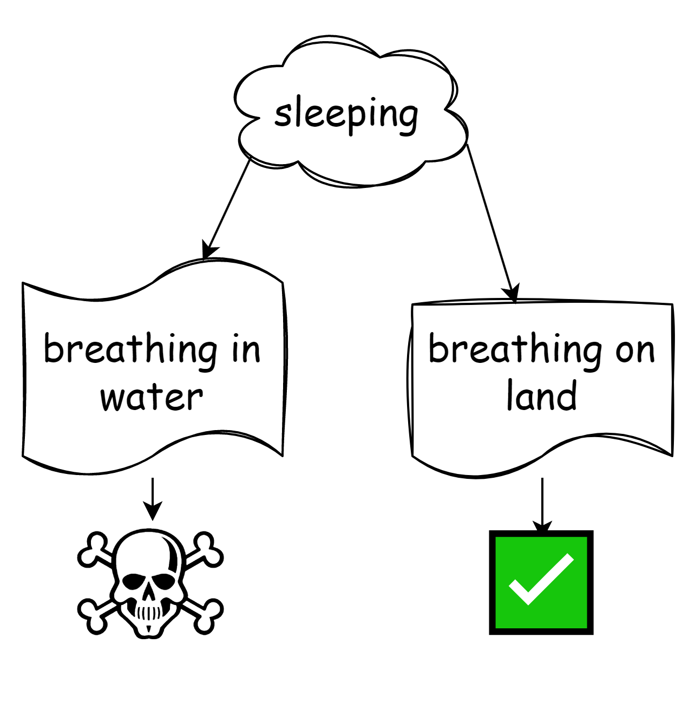

Hippopotamuses (or hippos for short) can breathe while sleeping underwater. They have a reflex that let's them rise to the surface, breathe, and sink again... all while remaining perfectly asleep. If this fact doesn't blow your friggin mind, then I don't like you very much and you should consider listening to The Shins.

Let's not get into the specifics of how this reflex mechanism works, nor into the biology of the matter, nor into the fact that "sleep" might itself be a complicated non-binary thing. Instead, Let's assume two states:

In both states, breathing is required. Now, hippos inhabit both land and water. Wise readers will notice almost immediately that breathing underwater, for mammals, poses unique challenges:

Sadly, mammals cannot oxygenate their blood while submerged in water. Again, we simplify the water/land divide into a binary choice, thus bypassing conversations about the shallow water, nostril protrusion, and mud.

Let us also point out that hippos are not to be trifled with. They are huge, powerful, and have a super thick hide. It takes a bit of a foolish animal to take one on... but hey, animals tend to be stupid, also, put enough stupid animals together and you never know(... huh), so even though the hippo doesn't have much to worry about, we can all agree that it would prefer to have the least number of predators around during sleepytimes... which in hippo habitats points to being underwater.

Except for the whole pesky death thing.

## Act of bravery and/or random luck
